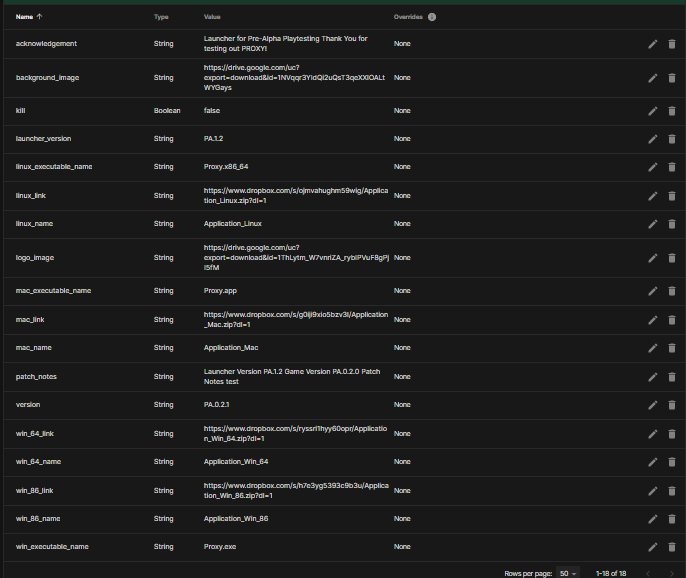

# Hosting
You can host the files on and http hosting service like dropbox, google drive or even onedrive. You would need to convert the links to direct download links using some kind of online converters. 
For example this is a direct download link for a dropbox file `https://www.dropbox.com/s/SOME_ID/Application_Zip?dl=1`

Google Drive shows a pop-up if the file is more than 50mb which breaks the download http request. You can either use [Google APIs](https://bytesbin.com/skip-google-drive-virus-scan-warning-large-files/) to get rid of the whole problem altogether... Or you could even do a [workaround via code](https://stackoverflow.com/a/44402826)

So the Remote Config variables would point to these variables... Here is an example (acknowledgement is basically subtitle.. I renamed it for my project)

### Also the \_name variables should be equal the name for the Zip files

# File Structure
The launcher detects its current directory and creates a `Data` folder on the same level as itself... The zip is downloaded and extracted inside this folder... 

# Compression
After compression, decompress the file and choose normal extraction (Not extract here or extract at 'X'). If the extracted file shows the game files directly under a folder with the Directory name then it would work fine. Though this can be edited in code if necessary. 

